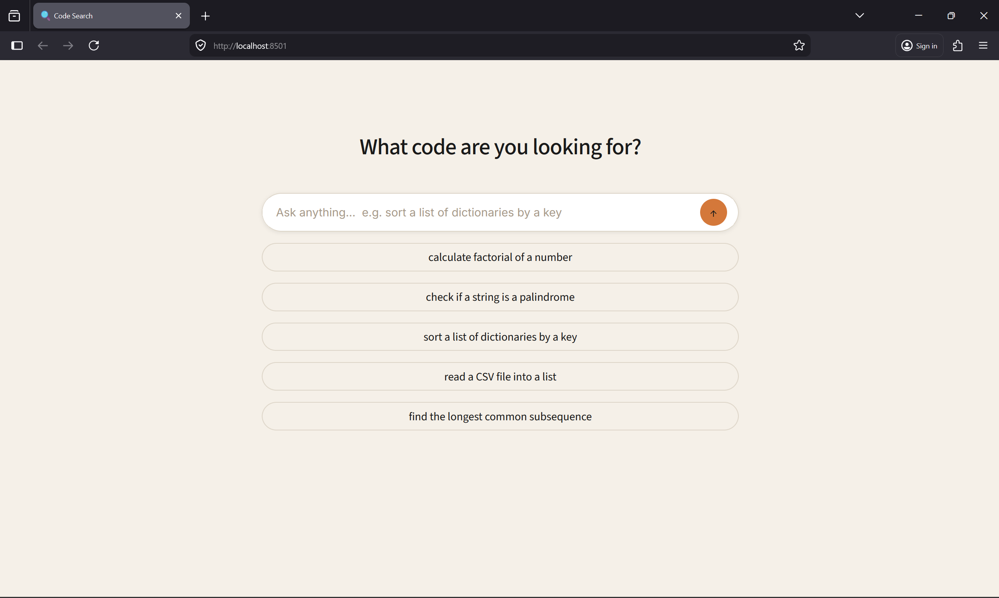
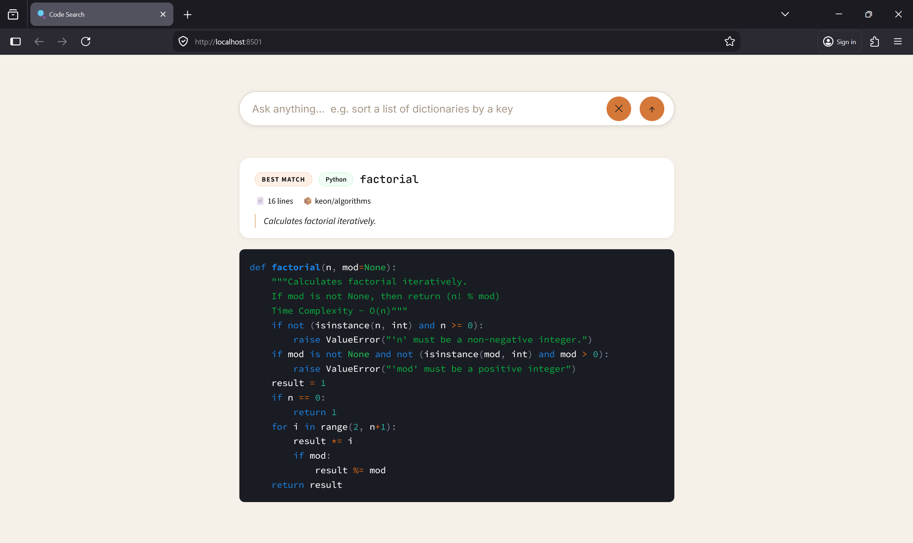

# Semantic Code Search and Recommendation Using Neural Embeddings

**Author:** Deeyan Vadwala
**Project Type:** Academic Research Project
**Language Scope:** Python source code

## Overview

This system retrieves relevant Python code snippets in response to natural language programming queries by leveraging learned semantic representations (transformer-based neural embeddings) rather than exact keyword matching. It combines dense semantic retrieval with sparse TF-IDF retrieval via Reciprocal Rank Fusion (RRF) and exposes results through a Streamlit web UI.

## Demo




## Architecture

```
┌──────────────────────────────────────────────────────┐
│                   INDEXING PIPELINE                   │
│                                                      │
│  Python Repos ──► AST Parser ──► Function Extractor  │
│                                       │              │
│                               Function + Docstring   │
│                                       │              │
│                               Embedding Model        │
│                            (multilingual-e5-large)   │
│                                       │              │
│                               FAISS Vector Index     │
└──────────────────────────────────────────────────────┘

┌──────────────────────────────────────────────────────┐
│                   SEARCH PIPELINE                    │
│                                                      │
│  NL Query ──► Embedding Model ──► Cosine Similarity  │
│                                        │             │
│                                  Re-ranking          │
│                              (length penalty +       │
│                               name similarity)       │
│                                        │             │
│                                  Top-K Results       │
└──────────────────────────────────────────────────────┘
```

### Key Components

| Component | Description |
|-----------|-------------|
| `multilingual-e5-large` | Transformer embedding model (1024-dim); shared query/code space |
| FAISS | Lightweight vector index for approximate nearest-neighbour search |
| TF-IDF (scikit-learn) | Sparse keyword baseline (unigrams + bigrams, used in evaluation) |
| Re-ranker | Applies length penalty, function-name similarity, and web-handler heuristics |

## Project Structure

```
semantic_code_search/
├── README.md                     # This file
├── requirements.txt              # Dependencies
├── config.py                     # Central configuration & hyperparameters
├── app.py                        # Streamlit web UI
├── main_index.py                 # Step 1: Build FAISS index
├── main_search.py                # Step 2: Interactive CLI search
├── main_evaluate.py              # Step 3: Run evaluation
├── data/
│   ├── download_dataset.py       # Download CodeSearchNet dataset
│   ├── raw/                      # Raw data storage
│   └── processed/                # Processed / cached data
├── models/
│   ├── embedding_model.py        # Transformer embedding wrapper
│   ├── indexer.py                # FAISS index builder
│   ├── semantic_search.py        # Dense semantic search engine
│   ├── keyword_search.py         # TF-IDF keyword baseline
├── evaluation/
│   ├── queries.py                # 50 curated evaluation queries
│   ├── benchmark.py              # Full evaluation pipeline
│   ├── run_eval.py               # Semantic vs Hybrid benchmarking script
│   └── metrics.py                # Recall@K, MRR, Precision@K
├── indexes/                      # FAISS index + metadata (generated)
├── results/                      # Evaluation output
└── ss/                           # UI screenshots
```

## Setup & Execution

### 1. Install Dependencies
```bash
pip install -r requirements.txt
```

### 2. Download Dataset (CodeSearchNet — Python subset)
```bash
python data/download_dataset.py
```

### 3. Build the Index
```bash
python main_index.py
```
Embeds up to 200,000 Python functions and saves a FAISS index to `indexes/`.

### 4. Interactive CLI Search
```bash
python main_search.py
```

### 5. Streamlit Web UI
```bash
streamlit run app.py
```
Opens a browser-based search interface. Supports uploading custom `.py` files to extend the index at runtime.

### 6. Run Evaluation
```bash
python evaluation/run_eval.py
```
Benchmarks semantic search over 50 curated queries and prints an MRR / Recall@K table.

## Evaluation Metrics

| Metric | Description |
|--------|-------------|
| **MRR** | Mean Reciprocal Rank — average of `1 / rank` of the first relevant result |
| **Recall@K** | Fraction of queries where a relevant result appears in the top K (K ∈ {1, 3, 5, 10}) |
| **Precision@K** | Average fraction of relevant results in the top K |

Relevance is approximated by keyword overlap between the query and the function name + docstring (no manual ground-truth labels required).

## Configuration

All hyperparameters live in [config.py](config.py):

| Setting | Default | Notes |
|---------|---------|-------|
| `EMBEDDING_MODEL_NAME` | `intfloat/multilingual-e5-large` | 1024-dim E5 model |
| `MAX_FUNCTIONS` | 200,000 | Increase for larger corpora |
| `TOP_K_CANDIDATES` | 50 | Initial retrieval pool size |
| `TOP_K_FINAL` | 10 | Results after re-ranking |
| `NAME_SIMILARITY_WEIGHT` | 0.10 | Contribution of name matching to score |
| `FAISS_USE_GPU` | `False` | Set `True` if a CUDA GPU is available |

## Design Decisions

1. **Shared embedding space** — `multilingual-e5-large` maps both natural language queries and code (+ docstrings) into the same 1024-dim vector space, validated by Ryu et al. (2025) for code search.
2. **Docstrings as NL proxy** — Uses existing docstrings instead of LLM-generated summaries, keeping inference cost low.
3. **FAISS over Elasticsearch** — Lightweight, zero-infrastructure vector search suitable for local and academic use.
4. **Conservative re-ranking** — Short-code penalties are intentionally small (1–4%) to avoid demoting legitimate short utility functions.

## References

- Husain et al. (2019). *CodeSearchNet Challenge: Evaluating the State of Semantic Code Search.*
- Ryu et al. (2025). *SEMANTIC CODE FINDER: Leveraging Large Language Models for Enhanced Code Retrieval.*
- Cormack, Clarke & Buettcher (2009). *Reciprocal Rank Fusion outperforms Condorcet and individual Rank Learning Methods.*
